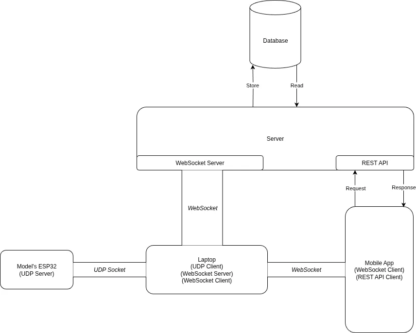

# 🦼 Tahady Elerada

Smart Wheelchair with multiple control modes, we have integrated many AI solutions to improve the wheelchair usability such as head pose estimation, eye tracking, voice translation and hand gesture. Our control modes are Face movement, Eye Movement, Voice commands, Hand directions, Remote control through the mobile application and manual mode(joystick). We also have developed a mobile application for mode selection, Healthcare monitoring, analyzing patient vital measures, display analytical graphs,and control the wheelchair remotely. We attached to the wheelchair medical sensors for heart rate, Oxygen level and temperature.

## 📹 [Project Demo](https://drive.google.com/file/d/1kU_K-7-edA8elcgbR45PkRvwaFl7sU1H/view?usp=drive_link)

## 🌟 Project Repositories

### 📱 [Mobile App](https://github.com/ahmed0nasser/gp-mobile-app)

### 💾 [Backend](https://github.com/ahmed0nasser/gp-backend)

### 💻 [Laptop Program](https://github.com/ahmed0nasser/gp-laptop-program)

### 🪫 [Hardware](https://github.com/MohamedSaeed130/Graduation-Project-Smart-Wheelchair-)

## 🎨 System Design

## 🪲 Testing

Special Thanks to Testination – ITI Software Testing Team for providing thorough testing to our application. \

## 📜 Credits

- Ahmed Nasser
- Ahmed Nabil
- Mohamed Abu Samaha
- Mohamed Abdo
- Abdullah Elgohary
